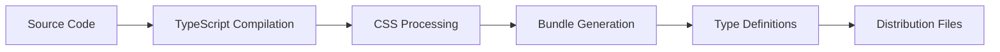

# Architecture Overview

Learn how Guru UI is built and organized. Understanding the architecture will help you use the library effectively and contribute to its development.

## Design Principles

### Multi-Framework First

Guru UI is designed from the ground up to work across multiple frameworks:

- **Shared Core Logic** - Business logic is framework-agnostic
- **Framework Adapters** - Thin wrappers for React, Vue, and vanilla JS
- **Consistent APIs** - Same props and behavior across all frameworks
- **Unified Styling** - Single CSS file works everywhere

### Component Architecture

Each component follows a layered architecture:

```
┌─────────────────────┐
│   Framework Layer   │  React, Vue, Vanilla wrappers
├─────────────────────┤
│    Core Logic       │  Shared business logic
├─────────────────────┤
│   Styling Layer     │  CSS classes and variables
└─────────────────────┘
```

### Accessibility First

Every component is built with accessibility as a primary concern:

- **ARIA Support** - Proper semantic markup
- **Keyboard Navigation** - Full keyboard support
- **Screen Readers** - Tested with assistive technology
- **Focus Management** - Logical focus flow

## Directory Structure

```
src/
├── components/          # Framework-specific components
│   ├── Button.tsx      # React components
│   ├── Modal.tsx
│   └── ...
├── core/               # Framework-agnostic logic
│   ├── ButtonCore.ts   # Business logic and utilities
│   ├── ModalCore.ts
│   └── index.ts
├── vue/                # Vue 3 components
│   ├── Button.vue
│   ├── Modal.vue
│   └── index.ts
├── vanilla/            # Vanilla JavaScript
│   ├── Button.ts
│   ├── Modal.ts
│   └── index.ts
├── theme/              # Theming system
│   ├── ThemeProvider.tsx
│   └── presets.ts
├── utils/              # Utility functions
│   ├── cn.ts          # Class name utility
│   └── index.ts
├── types/              # TypeScript definitions
│   └── css.d.ts
├── styles.css          # Global styles
└── index.ts           # Main entry point
```

## Core System

The core system provides shared functionality across all frameworks:

### ButtonCore Example

```typescript
// src/core/ButtonCore.ts
export interface ButtonCoreOptions {
  variant?: 'primary' | 'secondary' | 'outline' | 'ghost' | 'danger'
  size?: 'sm' | 'md' | 'lg' | 'xl'
  disabled?: boolean
  loading?: boolean
}

export class ButtonCore {
  static getClasses(options: ButtonCoreOptions): string {
    // Generate CSS classes based on options
  }
  
  static getAccessibilityProps(options: ButtonCoreOptions): object {
    // Return ARIA attributes and other a11y props
  }
  
  static getVariantClasses(variant: string): string {
    // Return variant-specific classes
  }
}
```

### Benefits of Core System

- **Consistency** - Same logic across all frameworks
- **Maintainability** - Single source of truth
- **Testing** - Test logic once, works everywhere
- **Performance** - Shared code reduces bundle size

## Framework Implementations

### React Component

```tsx
// src/components/Button.tsx
import { ButtonCore, type ButtonCoreOptions } from '../core/ButtonCore'

export type ButtonProps = React.ButtonHTMLAttributes<HTMLButtonElement> & 
  ButtonCoreOptions

export const Button = React.forwardRef<HTMLButtonElement, ButtonProps>(
  ({ variant = 'primary', size = 'md', ...props }, ref) => {
    const classes = ButtonCore.getClasses({ variant, size })
    const a11yProps = ButtonCore.getAccessibilityProps({ variant, size })
    
    return (
      <button 
        ref={ref}
        className={classes}
        {...a11yProps}
        {...props}
      />
    )
  }
)
```

### Vue Component

```vue
<!-- src/vue/Button.vue -->
<template>
  <button 
    :class="classes"
    v-bind="accessibilityProps"
    @click="$emit('click', $event)"
  >
    <slot />
  </button>
</template>

<script setup lang="ts">
import { computed } from 'vue'
import { ButtonCore, type ButtonCoreOptions } from '../core/ButtonCore'

interface Props extends ButtonCoreOptions {
  // Vue-specific props
}

const props = withDefaults(defineProps<Props>(), {
  variant: 'primary',
  size: 'md'
})

const classes = computed(() => ButtonCore.getClasses(props))
const accessibilityProps = computed(() => ButtonCore.getAccessibilityProps(props))
</script>
```

### Vanilla JavaScript

```typescript
// src/vanilla/Button.ts
import { ButtonCore, type ButtonCoreOptions } from '../core/ButtonCore'

export interface ButtonOptions extends ButtonCoreOptions {
  text?: string
  onClick?: (event: Event) => void
}

export class GuruButton {
  constructor(element: HTMLElement, options: ButtonOptions) {
    this.element = element
    this.options = options
    this.init()
  }
  
  private init() {
    const classes = ButtonCore.getClasses(this.options)
    const a11yProps = ButtonCore.getAccessibilityProps(this.options)
    
    this.element.className = classes
    Object.assign(this.element, a11yProps)
    
    if (this.options.onClick) {
      this.element.addEventListener('click', this.options.onClick)
    }
  }
}

// Auto-initialization from data attributes
export function initializeButtons() {
  document.querySelectorAll('[data-guru-button]').forEach(element => {
    const options = getOptionsFromAttributes(element)
    new GuruButton(element as HTMLElement, options)
  })
}
```

## Styling System

### CSS Variable Architecture

Guru UI uses CSS custom properties for theming:

```css
:root {
  --guru-background: #121212;
  --guru-heading: #ffffff;
  --guru-body: #b3b3b3;
  --guru-accent: #ffffff;
  --guru-accent-hover: #e5e5e5;
  --guru-on-accent: #0b0b0b;
  --guru-radius: 0.5rem;
  --guru-font: Inter, sans-serif;
}
```

### Component-Specific Styles

Each component uses CSS variables for customization:

```css
.guru-button {
  background: var(--guru-accent);
  color: var(--guru-on-accent);
  border-radius: var(--guru-radius);
  font-family: var(--guru-font);
}

.guru-button:hover {
  background: var(--guru-accent-hover);
}
```

### Tailwind Integration

Components use Tailwind classes but allow overrides:

```typescript
const buttonClasses = cn(
  'inline-flex items-center justify-center',
  'rounded-[var(--guru-radius)]',
  'bg-[color:var(--guru-accent)]',
  'text-[color:var(--guru-on-accent)]',
  customClassName
)
```

## Build System

### Development Workflow



### Build Outputs

The build process generates multiple outputs:

- **dist/index.js** - React components (default)
- **dist/vue.js** - Vue 3 components
- **dist/vanilla.js** - Vanilla JavaScript
- **dist/core.js** - Core logic only
- **style.css** - Compiled styles
- ***.d.ts** - TypeScript definitions

### Vite Configuration

```typescript
// vite.config.ts
export default defineConfig({
  build: {
    lib: {
      entry: {
        index: './src/index.ts',
        vue: './src/vue/index.ts',
        vanilla: './src/vanilla/index.ts',
        core: './src/core/index.ts'
      },
      formats: ['es']
    },
    rollupOptions: {
      external: ['react', 'react-dom', 'vue'],
      output: {
        preserveModules: true,
        assetFileNames: '[name][extname]'
      }
    }
  },
  plugins: [
    react(),
    vue(),
    dts({
      entryRoot: './src',
      outDir: './dist'
    })
  ]
})
```

## Performance Optimizations

### Tree Shaking

Components are designed for optimal tree shaking:

```typescript
// Each component is a separate export
export { Button } from './components/Button'
export { Modal } from './components/Modal'

// Core utilities are also tree-shakeable
export { ButtonCore } from './core/ButtonCore'
export { ModalCore } from './core/ModalCore'
```

### Bundle Splitting

Framework-specific builds prevent unnecessary code:

```typescript
// React users only get React code
import { Button } from 'guru-ui'

// Vue users only get Vue code
import { Button } from 'guru-ui/vue'

// Core users get minimal bundle
import { ButtonCore } from 'guru-ui/core'
```

### CSS Optimization

- **PostCSS** - Processes and optimizes CSS
- **PurgeCSS** - Removes unused styles in production
- **CSS Variables** - Runtime theming without rebuilds

## Testing Strategy

### Unit Testing

Each component layer is tested independently:

```typescript
// Core logic tests
describe('ButtonCore', () => {
  test('generates correct classes', () => {
    const classes = ButtonCore.getClasses({ variant: 'primary' })
    expect(classes).toContain('bg-accent')
  })
})

// React component tests
describe('Button', () => {
  test('renders with correct props', () => {
    render(<Button variant="primary">Click me</Button>)
    expect(screen.getByRole('button')).toHaveClass('bg-accent')
  })
})
```

### Integration Testing

Cross-framework compatibility is tested:

```typescript
// Test that all frameworks produce same output
test('consistent rendering across frameworks', () => {
  const reactOutput = renderReactButton({ variant: 'primary' })
  const vueOutput = renderVueButton({ variant: 'primary' })
  const vanillaOutput = renderVanillaButton({ variant: 'primary' })
  
  expect(extractClasses(reactOutput)).toEqual(extractClasses(vueOutput))
  expect(extractClasses(vueOutput)).toEqual(extractClasses(vanillaOutput))
})
```

### Accessibility Testing

Automated accessibility testing ensures compliance:

```typescript
test('accessibility compliance', async () => {
  const { container } = render(<Button>Click me</Button>)
  const results = await axe(container)
  expect(results).toHaveNoViolations()
})
```

## Contributing Guidelines

### Adding New Components

1. Create core logic in `src/core/ComponentCore.ts`
2. Implement React component in `src/components/Component.tsx`
3. Implement Vue component in `src/vue/Component.vue`
4. Implement vanilla component in `src/vanilla/Component.ts`
5. Add exports to respective index files
6. Write tests for all implementations
7. Update documentation

### Code Standards

- **TypeScript** - Use strict mode, no any types
- **ESLint** - Follow configured rules
- **Prettier** - Consistent code formatting
- **Conventional Commits** - Semantic commit messages

### Testing Requirements

- Unit tests for core logic
- Component tests for each framework
- Accessibility tests with axe
- Visual regression tests with Chromatic
- Cross-browser testing

## Future Architecture

### Planned Improvements

- **Web Components** - Native custom elements support
- **Svelte Support** - Additional framework adapter
- **CSS-in-JS** - Optional styling approach
- **Server Components** - React Server Components support

### Extensibility

The architecture supports future extensions:

- New frameworks can be added easily
- Core system accommodates new features
- Plugin system for custom functionality
- Theme marketplace integration

This architecture ensures Guru UI remains maintainable, performant, and extensible as it grows.
